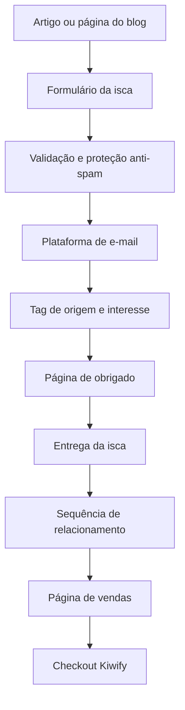

## Relação com os demais documentos

Este checklist faz parte da documentação oficial da Escola de Pais Online e deve ser utilizado em conjunto com:

1. Documentacao_Projeto_Escola_de_Pais_Online_v3_atualizada.md

Arquitetura do projeto, infraestrutura, roadmap e decisões técnicas.

2. Manual_de_Design_e_Interface_Escola_de_Pais_Online.md

Sistema de Design, identidade visual, componentes reutilizáveis e padrões de interface.

Este documento possui caráter operacional e registra apenas a ordem prática de implementação, validação e publicação do Blog.


# Estrutura e Checklist de Implementação do Blog — Escola de Pais Online

**Versão:** 1.0  
**Data:** julho de 2026  
**Objetivo:** documentar a arquitetura, o conteúdo, a captação de leads e a conversão do blog, permitindo implementar uma etapa por vez sem refazer decisões anteriores.

---

# PARTE 1 — Estratégia, arquitetura e páginas

## 1. Estratégia editorial definida

### Público inicial

- Pais e responsáveis por crianças de 6 a 9 anos.
- Pessoas que sabem resolver contas básicas, mas têm dificuldade para explicá-las à criança.
- Dor central: **“Eu sei a resposta, mas não sei como explicar para meu filho entender.”**
- Público secundário futuro: pedagogos, professores auxiliares e familiares que acompanham tarefas.

### Objetivos do blog

1. Atrair tráfego orgânico por dúvidas reais pesquisadas no Google.
2. Ajudar o visitante com uma resposta prática e confiável.
3. Capturar o e-mail quando a pessoa ainda não está pronta para comprar.
4. Levar para a página de vendas quando o artigo demonstra intenção de solução.
5. Criar autoridade para a marca Escola de Pais Online.

### Regra editorial

Cada artigo deve ter **um objetivo de conversão principal**:

- **captura de e-mail**, nos artigos informativos e de atividades;
- **página de vendas**, nos artigos ligados diretamente à dor que o Explicador Matemático resolve;
- **checkout**, apenas em páginas ou blocos de oferta para visitantes que já conhecem o produto.

Não usar três chamadas concorrentes com a mesma força no mesmo ponto da página.

## 2. Produtos, iscas e CTAs

| Ativo | Papel no funil | Quando apresentar | CTA principal |
|---|---|---|---|
| Explicador Matemático | Produto principal | Artigos sobre dificuldade para explicar, tarefa estressante e operações básicas | “Conhecer o Explicador Matemático” |
| Página de vendas | Explicar mecanismo, benefícios e oferta | Visitante consciente do problema ou da solução | “Ver como funciona” |
| Checkout Kiwify | Finalizar compra | Apenas após oferta clara ou intenção alta | “Quero ajudar meu filho hoje” |
| Kit gratuito de atividades matemáticas | Isca digital inicial | Artigos informativos, exercícios e topo de funil | “Receber as atividades por e-mail” |
| E-books e bônus do produto | Reforço de valor da oferta | Página de vendas e conteúdos próximos da compra | “Ver tudo o que está incluído” |

### Isca inicial recomendada

Começar com **uma única isca ampla**, para reduzir trabalho e medir demanda:

> **Kit Gratuito: Atividades de Matemática para Fazer em Casa**

Conteúdo sugerido: atividades simples de soma, subtração, multiplicação e divisão, escolhidas do material já criado no Kids Builder. Depois da validação, criar versões específicas por operação.

### Matriz de CTA por intenção

| Tipo de artigo | Exemplo | CTA principal | CTA secundário |
|---|---|---|---|
| Informativo | “Como ensinar soma com objetos” | Baixar atividade | Conhecer o Explicador no final |
| Atividade | “Atividades de subtração para imprimir” | Receber o kit por e-mail | Ler artigo relacionado |
| Dor emocional | “Toda tarefa de matemática vira estresse?” | Ver como o Explicador funciona | Baixar atividade |
| Solução | “Como explicar matemática para uma criança” | Conhecer o Explicador | Receber kit gratuito |
| Comercial | “Ferramenta para ajudar pais a ensinar matemática” | Ir para página de vendas | Ir ao checkout somente após a oferta |

## 3. Organização de categorias

### Categoria publicada no lançamento

**Matemática** — `/blog/matematica/`

Subtemas usados para organizar os artigos e os links internos:

- alfabetização matemática;
- soma;
- subtração;
- multiplicação;
- divisão;
- atividades matemáticas;
- dificuldade em matemática;
- tarefa de casa.

Os subtemas começam como agrupamentos editoriais. Criar uma página própria para um subtema somente quando houver pelo menos três artigos úteis sobre ele.

### Categorias futuras

Não exibir no menu antes de terem conteúdo e produto relacionados:

- Leitura e escrita;
- Rotina escolar;
- Desenvolvimento e aprendizagem;
- Recursos para pais e pedagogos.

### Regra para novas categorias

Abrir uma nova categoria somente quando existirem:

- um problema claro do público;
- ao menos um produto ou isca relacionado;
- um artigo pilar planejado;
- pelo menos cinco artigos de apoio previstos.

## 4. Mapa de páginas e URLs

| Página | URL | Função |
|---|---|---|
| Site/página de vendas atual | `/` | Vender o Explicador Matemático |
| Página inicial do blog | `/blog/` | Apresentar categorias, artigos principais e isca |
| Categoria Matemática | `/blog/matematica/` | Reunir os conteúdos do tema |
| Artigo | `/blog/matematica/nome-do-artigo/` | Atrair, ensinar e converter |
| Recursos gratuitos | `/recursos/` | Reunir iscas digitais disponíveis |
| Landing page da isca | `/recursos/atividades-de-matematica/` | Capturar o e-mail |
| Confirmação | `/obrigado/atividades-de-matematica/` | Confirmar cadastro, entregar acesso e sugerir próximo passo |
| Sobre | `/sobre/` | Apresentar missão, público e proposta da marca |
| Contato | `/contato/` | Disponibilizar canal de atendimento |
| Política de privacidade | `/politica-de-privacidade/` | Informar tratamento de dados |
| Termos de uso | `/termos-de-uso/` | Estabelecer regras do site e dos materiais |

### Padrão de URL

- letras minúsculas;
- palavras separadas por hífen;
- sem acentos, datas ou palavras desnecessárias;
- não alterar a URL depois de indexada, salvo necessidade real e com redirecionamento.

Exemplo: `/blog/matematica/como-ensinar-subtracao-para-criancas/`.

## 5. Navegação

### Cabeçalho

- Logo Escola de Pais Online;
- Início;
- Blog;
- Matemática;
- Recursos gratuitos;
- botão destacado: **Conhecer o Explicador Matemático**.

### Rodapé

- breve descrição da marca;
- links para Blog, Matemática, Recursos, Sobre e Contato;
- Política de Privacidade e Termos de Uso;
- acesso ao produto;
- direitos autorais;
- aviso de que o conteúdo apoia os pais, mas não substitui avaliação profissional quando houver dificuldade persistente.

### Breadcrumbs

Exemplo: `Início > Blog > Matemática > Como ensinar soma`.

## 6. Estrutura de diretórios

```text
/
├── index.html
├── blog/
│   ├── index.html
│   └── matematica/
│       ├── index.html
│       ├── como-explicar-matematica-para-criancas/
│       │   └── index.html
│       └── [demais-artigos]/
│           └── index.html
├── recursos/
│   ├── index.html
│   └── atividades-de-matematica/
│       └── index.html
├── obrigado/
│   └── atividades-de-matematica/
│       └── index.html
├── sobre/
│   └── index.html
├── contato/
│   └── index.html
├── politica-de-privacidade/
│   └── index.html
├── termos-de-uso/
│   └── index.html
├── functions/
│   └── api/
│       └── capturar-lead.js
├── assets/
│   ├── css/
│   │   ├── global.css
│   │   ├── blog.css
│   │   └── artigo.css
│   ├── js/
│   │   ├── main.js
│   │   ├── captura.js
│   │   └── analytics.js
│   ├── images/
│   │   ├── blog/
│   │   ├── artigos/
│   │   └── iscas/
│   └── icons/
├── robots.txt
└── sitemap.xml
```

## 7. Templates obrigatórios

### Página inicial do blog

- título e promessa clara;
- artigo principal em destaque;
- bloco da categoria Matemática;
- artigos recentes;
- bloco de captura da isca;
- apresentação curta do Explicador Matemático;
- rodapé completo.

### Página de categoria

- título e introdução da categoria;
- artigo pilar em destaque;
- grade de artigos;
- filtros visuais por subtema, se necessários;
- bloco de captura;
- CTA do produto no fim.

### Artigo

- breadcrumb;
- título H1;
- subtítulo que confirma a promessa;
- data de atualização;
- imagem principal;
- introdução curta;
- índice com links internos, quando o texto for longo;
- desenvolvimento em H2 e H3;
- exemplos práticos;
- CTA contextual no meio;
- bloco de isca ou produto;
- perguntas frequentes;
- artigos relacionados;
- CTA final;
- rodapé.

### Landing page da isca

- promessa específica;
- imagem/mockup do material;
- três a cinco benefícios;
- formulário curto;
- informação sobre privacidade;
- sem menu extenso ou distrações;
- prova/explicação do que será recebido;
- CTA único.

### Página de obrigado

- confirmação do cadastro;
- instrução de acesso ao material;
- botão de download, se a entrega for direta;
- orientação para conferir spam e promoções;
- CTA leve para o Explicador Matemático;
- um artigo recomendado.

---

# PARTE 2 — Captura de e-mails, automação e conversão

## 8. Fluxo completo de captura



### Dados do formulário

Obrigatório:

- e-mail.

Opcional:

- primeiro nome;
- faixa etária do filho: 6–7, 8–9 ou outra.

Não solicitar nome da criança, escola, notas ou outros dados infantis. Coletar apenas o necessário para entregar o material e segmentar o conteúdo.

### Consentimento

Incluir texto próximo ao botão:

> Ao enviar, você concorda em receber o material e conteúdos da Escola de Pais Online. Você pode cancelar a inscrição a qualquer momento. Consulte a Política de Privacidade.

O botão deve descrever a ação: **“Quero receber as atividades”**, em vez de apenas “Enviar”.

## 9. Arquitetura técnica da captura

Como o site permanece em HTML no Cloudflare Pages, usar:

1. formulário HTML no artigo ou landing page;
2. requisição para `/api/capturar-lead`;
3. Cloudflare Pages Function para validar e processar a inscrição;
4. Turnstile para proteção contra bots, com validação também no servidor;
5. envio do contato à plataforma de e-mail por API;
6. redirecionamento para a página de obrigado;
7. disparo do evento de conversão após resposta de sucesso.

### Regras de segurança

- Chaves da plataforma de e-mail ficam em variáveis de ambiente, nunca no HTML, JavaScript público ou GitHub.
- O sucesso só é registrado depois de a API confirmar a inscrição.
- Validar formato do e-mail e limitar tentativas repetidas.
- Exibir mensagens claras para erro, cadastro existente e indisponibilidade temporária.
- Não salvar uma planilha pública com e-mails.

### Alternativa inicial mais simples

Se a plataforma de e-mail fornecer formulário incorporável confiável, ele pode ser usado na primeira versão. Migrar para a Function quando for necessário controlar melhor design, tags, eventos e mensagens de erro.

## 10. Plataforma de e-mail

### Decisão pendente

- [ ] Confirmar a plataforma de e-mail marketing.
- [ ] Verificar formulário, API, automações, tags, exportação e descadastro.
- [ ] Criar lista principal: **Leads — Escola de Pais Online**.

### Tags mínimas

| Campo/tag | Exemplo | Finalidade |
|---|---|---|
| `origem` | `blog` | Identificar o canal |
| `isca` | `atividades-matematica` | Saber qual material gerou o lead |
| `tema` | `soma` | Identificar o interesse editorial |
| `pagina_origem` | slug do artigo | Medir a página que converteu |
| `utm_campaign` | nome da campanha | Preservar origem de campanhas |
| `estagio` | `lead` | Controlar ciclo de relacionamento |

Não criar listas separadas para cada artigo. Manter uma lista principal e segmentar por tags/campos.

## 11. Sequência inicial de e-mails

| Momento | Objetivo | Conteúdo | CTA |
|---|---|---|---|
| Imediato | Entregar | Link para o kit e instruções | Acessar as atividades |
| Dia 1 | Gerar resultado rápido | Como usar uma atividade sem transformar em prova | Testar uma atividade |
| Dia 3 | Aprofundar a dor | Por que saber a resposta não significa saber explicar | Ler artigo relacionado |
| Dia 5 | Apresentar o mecanismo | Mostrar o que falar, mostrar e praticar com a criança | Conhecer o Explicador |
| Dia 7 | Fazer oferta | Benefícios, acesso e chamada clara | Ir para a página de vendas |

### Regras da automação

- interromper e-mails de venda inadequados para quem já comprou, se a integração permitir;
- incluir link de descadastro em todos os e-mails;
- não prometer resultados escolares garantidos;
- manter linguagem simples, acolhedora e voltada aos pais;
- testar todos os links antes de ativar.

## 12. Posições de CTA no artigo

1. **Após a introdução:** link discreto para a solução ou recurso relacionado.
2. **Após o primeiro bloco prático:** CTA contextual, sem interromper a resposta.
3. **Depois de aproximadamente metade do artigo:** bloco visual da isca ou do produto.
4. **Após a conclusão:** CTA principal do artigo.
5. **Artigos relacionados:** manter o visitante no cluster.

### Exemplos de CTA

**Captura:**

> Quer praticar com seu filho? Receba gratuitamente atividades de matemática para fazer em casa.

Botão: **Receber as atividades por e-mail**

**Produto — contextual:**

> Se a dificuldade está em encontrar as palavras certas para explicar, o Explicador Matemático mostra o que dizer, o que mostrar e como praticar cada conta.

Botão: **Ver como o Explicador funciona**

**Produto — final:**

> Você não precisa improvisar toda vez que seu filho pedir ajuda.

Botão: **Conhecer o Explicador Matemático**

## 13. Mensuração

### Eventos recomendados no GA4/GTM

| Evento | Momento |
|---|---|
| `view_blog_home` | Visualização da página inicial do blog |
| `view_article` | Visualização de artigo |
| `scroll_50` | Leitura de 50% do artigo |
| `scroll_90` | Leitura de 90% do artigo |
| `lead_form_start` | Primeiro uso do formulário |
| `generate_lead` | Inscrição confirmada pela plataforma |
| `lead_magnet_download` | Clique no material |
| `cta_product_click` | Clique para conhecer o produto |
| `begin_checkout` ou evento já padronizado | Clique para checkout |

### Parâmetros úteis

- `article_slug`;
- `article_category`;
- `cta_position` (`intro`, `middle`, `final`, `sidebar`);
- `cta_type` (`lead`, `product`, `checkout`);
- `lead_magnet`;
- `destination_url`.

### Indicadores

- sessões orgânicas;
- cliques vindos do Google;
- posição e impressões no Search Console;
- taxa de leitura até 50% e 90%;
- taxa de conversão do formulário;
- leads por artigo;
- cliques para a página de vendas;
- início de checkout originado no blog;
- vendas assistidas pelo blog, quando mensuráveis.

### UTMs

Usar UTMs apenas em links de campanhas externas. Links internos do próprio site não recebem UTM, para não sobrescrever a origem real da sessão.

Padrão externo:

`utm_source=canal&utm_medium=formato&utm_campaign=campanha&utm_content=criativo`

---

# PARTE 3 — SEO, conteúdo e execução

## 14. SEO técnico e on-page

Cada página deve conter:

- `<title>` único;
- meta description única;
- URL canônica;
- H1 único;
- hierarquia correta de H2 e H3;
- imagem Open Graph;
- texto alternativo nas imagens informativas;
- favicon e identidade visual;
- dados estruturados adequados;
- links internos;
- data de atualização visível quando relevante;
- inclusão no `sitemap.xml`;
- indexação permitida somente em páginas completas.

### Dados estruturados

- `BlogPosting` nos artigos;
- `BreadcrumbList` nos breadcrumbs;
- `Organization` ou `WebSite` nas páginas institucionais;
- `FAQPage` apenas quando houver perguntas e respostas realmente visíveis na página e quando o uso estiver de acordo com as diretrizes vigentes.

### Imagens

- formato WebP ou AVIF quando possível;
- tamanho compatível com o espaço de exibição;
- nome descritivo do arquivo;
- largura e altura declaradas para reduzir mudança de layout;
- carregamento tardio nas imagens abaixo da primeira tela;
- imagem social 1200 × 630 px por artigo.

### Links internos

Cada artigo deve apontar para:

- o artigo pilar do cluster;
- dois ou três artigos relacionados;
- a categoria Matemática;
- a isca ou produto correspondente.

Evitar textos genéricos como “clique aqui”. Usar âncoras que descrevam a página de destino.

## 15. Clusters de conteúdo

### Pilar principal

**Como explicar matemática para uma criança entender**

Função: apresentar o problema central, ligar as quatro operações e conduzir ao Explicador Matemático.

### Cluster — Soma

- Como ensinar soma para crianças de forma simples;
- Como explicar soma usando objetos de casa;
- Atividades de soma para crianças de 6 a 9 anos;
- O que fazer quando a criança conta nos dedos;
- Como explicar o “vai um” sem confundir a criança.

### Cluster — Subtração

- Como ensinar subtração para crianças;
- Como explicar subtração usando objetos;
- Atividades de subtração para imprimir;
- Como explicar “emprestar” na subtração;
- Por que a criança confunde soma e subtração.

### Cluster — Multiplicação

- Como ensinar multiplicação sem começar pela decoração;
- Como explicar multiplicação com grupos e objetos;
- Atividades de multiplicação para crianças;
- Como ajudar a criança que não entende a tabuada.

### Cluster — Divisão

- Como ensinar divisão de forma simples;
- Como explicar divisão repartindo objetos;
- Atividades de divisão para iniciantes;
- O que fazer quando a criança não entende divisão.

### Cluster — Pais e tarefa de casa

- Eu sei a resposta, mas não sei explicar matemática;
- Toda tarefa de matemática vira estresse: o que fazer;
- Como ajudar sem entregar a resposta pronta;
- O que dizer quando a criança trava em uma conta;
- Como saber em qual etapa da conta a criança se perdeu.

## 16. Ordem editorial inicial

Publicar primeiro:

1. Como explicar matemática para uma criança entender — artigo pilar;
2. Eu sei a resposta, mas não sei explicar matemática;
3. Como ensinar soma para crianças de forma simples;
4. Como ensinar subtração para crianças;
5. Como ensinar multiplicação sem começar pela decoração;
6. Como ensinar divisão de forma simples;
7. Toda tarefa de matemática vira estresse: o que fazer;
8. Atividades de matemática para fazer em casa.

Depois, aprofundar o subtema que gerar mais impressões, cliques, leads e interesse comercial.

## 17. Processo de criação de artigo

### Antes de escrever

- [ ] Definir busca principal e intenção.
- [ ] Definir pergunta que o artigo resolverá.
- [ ] Escolher cluster e artigo pilar.
- [ ] Escolher objetivo de conversão.
- [ ] Definir isca ou produto relacionado.
- [ ] Listar links internos de entrada e saída.

### Durante a produção

- [ ] Responder a dúvida nas primeiras linhas.
- [ ] Usar exemplos simples e aplicáveis em casa.
- [ ] Evitar jargão pedagógico sem explicação.
- [ ] Não culpar pais ou crianças.
- [ ] Não fazer promessa garantida de aprendizagem.
- [ ] Inserir CTA contextual.
- [ ] Criar título, description e imagem social.

### Antes da publicação

- [ ] Revisar ortografia e clareza.
- [ ] Conferir H1, H2 e H3.
- [ ] Testar todos os links e botões.
- [ ] Testar formulário e página de obrigado.
- [ ] Validar eventos no GTM/GA4.
- [ ] Testar em celular, tablet e computador.
- [ ] Verificar desempenho e tamanho das imagens.
- [ ] Adicionar ao sitemap.
- [ ] Fazer commit com mensagem clara.
- [ ] Confirmar deploy no Cloudflare Pages.

### Depois da publicação

- [ ] Solicitar indexação no Search Console quando necessário.
- [ ] Adicionar links de artigos antigos para o novo.
- [ ] Conferir indexação e eventos.
- [ ] Revisar após 30, 60 e 90 dias.
- [ ] Atualizar conteúdo quando houver nova informação ou oportunidade.

## 18. Fases de Implementação

### Fase 1 — Fundação do Projeto [CONCLUÍDA]

Infraestrutura

[x] Estrutura principal de diretórios criada.
[x] Organização da pasta assets.
[x] Organização da pasta templates.
[x] Estrutura inicial do blog criada.

Documentação

[x] Documentação Geral atualizada.
[x] Checklist operacional criado.
[x] Manual de Design e Interface criado.
[x] Fase 1 do Manual concluída.
[x] Fase 2 do Manual concluída.

Interface

[x] assets/css/global.css aprovado.
[x] templates/layouts/base.html aprovado.

------------------------------------------------------------

### Fase 2 — Componentes Globais

Header

## Feature 01 — Header Global

Status: ✅ Concluído

Checklist

- [x] Estrutura HTML criada.
- [x] Logo integrada.
- [x] Navegação Desktop implementada.
- [x] Navegação Mobile implementada.
- [x] Menu Hambúrguer funcional.
- [x] CTA implementado.
- [x] Header Sticky implementado.
- [x] Responsividade validada.
- [x] Testes realizados no Live Server.
- [x] Compatibilidade com Cloudflare Pages validada.
- [x] Revisão concluída.
- [x] Feature aprovada.

## Feature 02 — Footer Global

Status: ✅ Concluído

Checklist

- [x] Estrutura HTML criada.
- [x] Logo integrada.
- [x] Descrição institucional implementada.
- [x] Links de Navegação implementados.
- [x] Links Institucionais implementados.
- [x] CTA do produto implementado.
- [x] Copyright implementado.
- [x] Aviso educacional implementado.
- [x] Estilos adicionados ao global.css.
- [x] Layout mobile first implementado.
- [x] Responsividade validada.
- [x] Navegação por teclado validada.
- [x] Links e botão testados.
- [x] Integração com base.html validada.
- [x] Testes no Live Server concluídos.
- [x] Revisão concluída.
- [x] Feature aprovada.

------------------------------------------------------------

### Fase 3 — Estrutura do Blog

[x] Estrutura e estilização base da Página inicial (/blog/) — Feature 03A.
[x] Conteúdo definitivo da Página inicial (/blog/) — Feature 03B.
[x] CSS do Blog.
[x] Página da Categoria Matemática — Features 04A e 04B. Status: ✅ Concluída.
[ ] Template de artigo — Feature 05A.
[ ] Página Sobre.
[ ] Página Contato.
[ ] Política de Privacidade.
[ ] Termos de Uso.

## Feature 03A — Estrutura da Página Inicial do Blog

Status: ✅ Concluída

Checklist

- [x] Estrutura HTML semântica criada em `blog/index.html`.
- [x] Header Global e Footer Global integrados.
- [x] Hero do Blog implementado.
- [x] Barra de pesquisa visual implementada.
- [x] Artigo em destaque estruturado.
- [x] Bloco da categoria Matemática estruturado.
- [x] Grade com seis cards provisórios implementada.
- [x] CTA do Explicador Matemático implementado.
- [x] Espaços de imagem preparados para a Feature 03B.
- [x] Arquivo `assets/css/blog.css` criado e integrado.
- [x] Layout mobile first implementado.
- [x] Responsividade validada em 390 px, 768 px e desktop.
- [x] Ausência de rolagem horizontal validada.
- [x] Estrutura HTML e CSS revisada.
- [x] Testes visuais concluídos.
- [x] Feature aprovada.

------------------------------------------------------------

## Feature 03B — Conteúdo da Página Inicial do Blog

Status: ✅ Concluída

Planejamento Editorial

- [x] Planejamento Editorial da Home do Blog concluído e aprovado.
- [x] Hero definitivo e CTA principal definidos.
- [x] Artigo pilar em destaque definido.
- [x] Seis artigos iniciais definidos.
- [x] Títulos, resumos, categorias e slugs oficiais definidos.
- [x] Briefings e textos alternativos das imagens definidos.
- [x] Conteúdo do bloco da categoria Matemática definido.
- [x] Texto auxiliar da pesquisa definido.
- [x] CTA do Explicador Matemático definido.

Implementação

- [x] Conteúdo definitivo implementado somente em `blog/index.html`.
- [x] Placeholders visíveis substituídos pelo conteúdo aprovado.
- [x] Hero e CTA principal implementados.
- [x] Artigo pilar em destaque implementado.
- [x] Seis cards iniciais implementados.
- [x] Categoria, títulos, resumos, links e CTAs implementados.
- [x] Textos alternativos aprovados aplicados aos placeholders das imagens.
- [x] Bloco da categoria Matemática implementado.
- [x] Texto auxiliar da pesquisa implementado.
- [x] CTA do Explicador Matemático implementado.
- [x] Estrutura HTML e hierarquia das seções preservadas.
- [x] CSS, Header, Footer e Design System preservados.

Validação

- [x] Visual validado em desktop, tablet e celular.
- [x] Responsividade validada.
- [x] Ausência de rolagem horizontal indevida validada.
- [x] Header e Footer preservados.
- [x] Menu mobile validado.
- [x] Navegação por teclado validada.
- [x] Links e slugs conferidos.
- [x] Campo e botão de pesquisa validados sem erros.
- [x] Placeholders visuais das imagens validados.
- [x] Ausência de textos provisórios no conteúdo visível confirmada.
- [x] Console validado sem erros relacionados à implementação.
- [x] Feature aprovada.

------------------------------------------------------------

## Feature 04A — Estrutura da Página da Categoria Matemática

Status: ✅ Concluída

Checklist

- [x] Estrutura HTML semântica criada em `blog/matematica/index.html`.
- [x] Header Global e Footer Global preservados.
- [x] Breadcrumb da categoria implementado.
- [x] Hero da categoria implementado.
- [x] Artigo pilar em destaque estruturado.
- [x] Grade responsiva preparada para seis artigos.
- [x] Bloco visual da isca digital implementado sem formulário.
- [x] CTA do Explicador Matemático implementado com o componente global.
- [x] Espaços visuais das imagens preparados para a Feature 04B.
- [x] Estilos existentes de `assets/css/blog.css` reutilizados.
- [x] Layout mobile first implementado.
- [x] Responsividade validada em 390 px, 768 px e desktop.
- [x] Ausência de rolagem horizontal validada.
- [x] Hierarquia de headings, foco visível e navegação por teclado validados.
- [x] Estrutura revisada e aprovada.
- [x] Feature aprovada.

------------------------------------------------------------

## Feature 04B — Conteúdo da Página da Categoria Matemática

Status: ✅ Concluída

Conteúdo Editorial

- [x] Hero definitivo da categoria implementado.
- [x] Artigo pilar oficial implementado.
- [x] Seis artigos oficiais da Home do Blog aplicados na mesma ordem editorial.
- [x] Títulos, resumos, categorias e slugs oficiais preservados.
- [x] Textos alternativos aprovados aplicados aos placeholders das imagens.
- [x] Conteúdo definitivo do bloco da isca digital implementado.
- [x] Conteúdo definitivo do CTA do Explicador Matemático implementado.

Implementação

- [x] Conteúdo definitivo implementado somente em `blog/matematica/index.html`.
- [x] Placeholders visíveis substituídos pelo conteúdo aprovado.
- [x] Estrutura HTML da Feature 04A preservada.
- [x] CSS, JavaScript, Header Global, Footer Global e Home do Blog preservados.
- [x] `noindex, nofollow` e metadados provisórios preservados.
- [x] Espaços visuais provisórios das imagens preservados.
- [x] Nenhum formulário ou captura de e-mail implementado.

Validação

- [x] Visual validado em 390 px, 768 px e desktop.
- [x] Grade validada com uma, duas e três colunas.
- [x] Ausência de rolagem horizontal indevida validada.
- [x] Exatamente seis cards confirmados.
- [x] Slugs conferidos com a Home do Blog.
- [x] Hierarquia H1, H2 e H3 validada.
- [x] Header e Footer preservados.
- [x] Menu mobile e navegação por teclado validados.
- [x] Ausência de textos provisórios no conteúdo visível confirmada.
- [x] Console validado sem erros relacionados à implementação.
- [x] Estrutura e conteúdo aprovados.
- [x] Feature aprovada.

------------------------------------------------------------

### Fase 4 — Captura

[ ] Finalizar a isca inicial.
[ ] Escolher e configurar a plataforma de e-mail.
[ ] Criar landing page e página de obrigado.
[ ] Implementar formulário.
[ ] Implementar proteção anti-spam.
[ ] Criar tags e sequência de cinco e-mails.
[ ] Testar cadastro, entrega, erro e descadastro.

------------------------------------------------------------

### Fase 5 — Conteúdo Inicial

[ ] Publicar artigo pilar.
[ ] Publicar os quatro artigos das operações.
[ ] Publicar dois artigos de dor emocional.
[ ] Publicar um artigo de atividades.
[ ] Conectar todos por links internos.

------------------------------------------------------------

### Fase 6 — Otimização

[ ] Acompanhar Search Console e GA4.
[ ] Identificar artigos com impressão e baixo clique.
[ ] Melhorar títulos e descriptions.
[ ] Testar texto e posição dos CTAs.
[ ] Criar nova isca apenas se os dados justificarem.
[ ] Expandir os clusters vencedores.


## 19. Critérios para considerar o blog pronto

- [ ] Navegação funciona em celular e computador.
- [ ] Blog, categoria e artigo têm identidade visual consistente.
- [ ] O visitante entende a proposta da Escola de Pais Online.
- [ ] Todos os artigos têm um CTA principal definido.
- [ ] A captura grava o contato e entrega o material.
- [ ] Privacidade, consentimento e descadastro estão implementados.
- [ ] Eventos aparecem no GA4/GTM.
- [ ] Links para página de vendas e checkout funcionam.
- [ ] Sitemap contém as páginas indexáveis.
- [ ] Páginas de obrigado, testes e arquivos internos não são indexados indevidamente.
- [ ] O fluxo completo foi testado em uma janela anônima e em um celular real.

## 20. Referências técnicas

- Cloudflare Pages Functions: https://developers.cloudflare.com/pages/functions/
- Formulários estáticos com Pages Functions: https://developers.cloudflare.com/pages/functions/plugins/static-forms/
- Cloudflare Turnstile: https://developers.cloudflare.com/turnstile/get-started/
- Validação do Turnstile no servidor: https://developers.cloudflare.com/turnstile/get-started/server-side-validation/

---

## Próxima ação definida

Implementar a Feature 05A — Estrutura do Template de Artigo.

Objetivo:

Criar a estrutura HTML e CSS reutilizável do Template de Artigo, preservando os componentes globais e o Design System aprovado, sem implementar ainda o conteúdo definitivo dos artigos.
