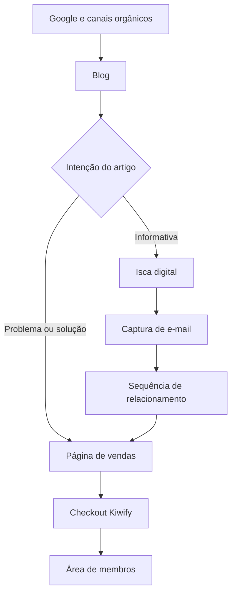
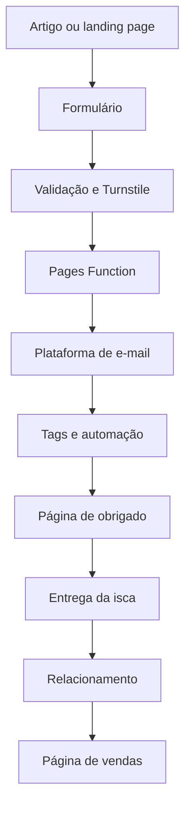

## Documentos Oficiais do Projeto

Este projeto é mantido com base em três documentos oficiais que devem ser utilizados em conjunto durante qualquer implementação.

1. Documentacao_Projeto_Escola_de_Pais_Online_v3_atualizada.md
   Arquitetura, infraestrutura, roadmap e decisões técnicas.

2. Checklist_Projeto_Blog_Escola_de_Pais_Online.md
   Checklist operacional e ordem prática de implementação do blog.

3. Manual_de_Design_e_Interface_Escola_de_Pais_Online.md
   Sistema de design, identidade visual, componentes e padrões de interface.

Toda implementação deve respeitar simultaneamente estes três documentos.


# Documentação Técnica — Escola de Pais Online
**Versão:** 3.1  
**Status:** Produção  
**Última atualização:** Julho/2026

---

# 1. Visão Geral

## Objetivo do projeto

A Escola de Pais Online é uma plataforma digital voltada para pais que desejam ajudar seus filhos na alfabetização matemática através do produto Explicador Matemático.

A arquitetura foi construída para ser simples, escalável e independente de plataformas proprietárias.

---

# 2. Arquitetura da Solução

```
Meta Ads
     │
     ▼
Página de Vendas
(escoladepaisonline.com.br)
     │
     ▼
Google Tag Manager
     │
 ┌───┴──────────────┐
 ▼                  ▼
GA4            Meta Pixel
                    │
                    ▼
             Evento InitiateCheckout
                    │
                    ▼
           Checkout Kiwify
                    │
      Purchase (Pixel + CAPI)
                    │
                    ▼
            Área de Membros
                    │
                    ▼
       Aplicativo HTML + Bônus
```

O blog adiciona um segundo fluxo de aquisição, voltado à construção de tráfego e relacionamento de longo prazo:



Os dois fluxos convivem no mesmo domínio, com a mesma identidade, mensuração e página de vendas.

---

# 3. Fluxo do Usuário

1. Visualiza anúncio.
2. Acessa página de vendas.
3. Consome a oferta.
4. Clica em Comprar.
5. Evento InitiateCheckout.
6. Checkout Kiwify.
7. Pagamento.
8. Evento Purchase.
9. Liberação automática da área de membros.
10. Uso do aplicativo.

---

# 4. Infraestrutura

## Domínio
- escoladepaisonline.com.br

## CDN
- Cloudflare

## Hospedagem
- Cloudflare Pages

## Repositório
- GitHub

## Deploy
GitHub → Cloudflare Pages (automático)

---

# 5. Estrutura do Projeto

```
/
├── index.html
├── blog/
│   ├── index.html
│   └── matematica/
│       ├── index.html
│       └── [slug-do-artigo]/
│           └── index.html
├── recursos/
│   ├── index.html
│   └── atividades-de-matematica/
│       └── index.html
├── obrigado/
│   └── atividades-de-matematica/
│       └── index.html
├── sobre/
│   └── index.html
├── contato/
│   └── index.html
├── politica-de-privacidade/
│   └── index.html
├── termos-de-uso/
│   └── index.html
├── functions/
│   └── api/
│       └── capturar-lead.js
├── assets/
│   ├── css/
│   │   ├── global.css
│   │   ├── blog.css
│   │   └── artigo.css
│   ├── js/
│   │   ├── main.js
│   │   ├── captura.js
│   │   └── analytics.js
│   ├── images/
│   │   ├── blog/
│   │   ├── artigos/
│   │   └── iscas/
│   └── icons/
├── explicador-matematico/
├── robots.txt
├── sitemap.xml
├── favicon.ico
└── site.webmanifest
```

---

# 6. Stack Tecnológica

## Front-end
- HTML5
- CSS3
- JavaScript

## Infraestrutura
- Cloudflare
- Cloudflare Pages
- GitHub

## Analytics
- Google Analytics 4
- Google Tag Manager

## Marketing
- Meta Pixel
- Meta Conversions API (via Kiwify)

## Checkout
- Kiwify

## Área de membros
- MemberApp

---

# 7. SEO

## Implementado

- robots.txt
- sitemap.xml
- Open Graph
- favicon
- HTTPS
- Search Console

## Objetivo

Construção de autoridade orgânica de longo prazo.

## Padrão do blog

- um `<title>` e uma meta description por página;
- H1 único e estrutura correta de H2/H3;
- URL canônica;
- Open Graph por artigo;
- imagens otimizadas com dimensões declaradas;
- `BlogPosting` nos artigos;
- `BreadcrumbList` nos breadcrumbs;
- links internos entre artigo pilar, cluster, categoria e conversão;
- atualização do sitemap a cada publicação;
- páginas incompletas, testes e páginas de obrigado fora do índice.

---

# 8. Mensuração

## Google Analytics

Eventos:

- page_view
- session_start
- scroll
- click
- user_engagement

## Meta

- PageView
- InitiateCheckout
- Lead
- Purchase

## Eventos adicionais do blog

- view_blog_home
- view_article
- scroll_50
- scroll_90
- lead_form_start
- generate_lead
- lead_magnet_download
- cta_product_click

---

# 9. Gerenciadores

## Google
- Analytics
- Tag Manager
- Search Console

## Meta
- Business Manager
- Events Manager
- Pixel
- Domínio verificado

---

# 10. Checklist Operacional

## Antes de publicar

- Página revisada
- Links testados
- Checkout funcionando
- Pixel ativo
- Analytics ativo
- GTM publicado

## Após publicar

- Conferir eventos
- Conferir vendas
- Conferir área de membros
- Conferir carregamento mobile

---

# 11. Backup e Versionamento

Código-fonte

- GitHub

Deploy

- Cloudflare Pages

Versionamento oficial

O projeto utiliza três níveis de versionamento:

1. Commit Git
Registro de cada alteração significativa no desenvolvimento.

2. Release do GitHub
Representa uma versão estável do projeto.

3. Backup Local
Cópia completa da pasta do projeto armazenada fora do diretório de desenvolvimento.

Versão atual

Release:
v1.0-foundation

Status:
Primeira versão estável da infraestrutura.

Boas práticas

- realizar commit ao concluir uma funcionalidade;
- publicar uma Release apenas quando uma etapa importante estiver finalizada;
- criar backup local após cada Release importante;
- manter o CHANGELOG atualizado.

---

# 12. Changelog

## v3.1

- arquitetura completa do blog;
- categorias, páginas, URLs e templates;
- fluxo técnico de captura de e-mails;
- regras de consentimento, tags e automação;
- matriz de CTAs alinhada ao Explicador Matemático;
- clusters, ordem editorial e processo de publicação;
- eventos de mensuração e fases de implementação.

## v3.0

- documentação técnica completa;
- arquitetura documentada;
- stack documentada;
- fluxo do usuário;
- checklist operacional;
- plano SEO.

## v2.0

- organização da infraestrutura;
- analytics;
- pixel;
- checkout.

## v1.0

- documentação inicial.

---

# 13. Estrutura Completa do Blog

## 13.1 Objetivo e público

O blog tem quatro funções:

1. atrair pais e responsáveis por buscas orgânicas;
2. resolver dúvidas práticas sobre matemática de crianças de 6 a 9 anos;
3. capturar e-mails de visitantes que ainda não estão prontos para comprar;
4. conduzir visitantes com intenção maior ao Explicador Matemático.

Dor editorial central:

> “Eu sei a resposta, mas não sei como explicar para meu filho entender.”

Público secundário futuro: pedagogos, professores auxiliares e familiares que acompanham tarefas. A expansão só entra após validação do primeiro cluster.

## 13.2 Regra de conversão

Cada artigo possui um único objetivo principal:

- **captura de e-mail** em conteúdos informativos, exercícios e atividades;
- **página de vendas** em conteúdos sobre dor, explicação e solução;
- **checkout** somente depois de uma oferta clara e para visitantes com intenção alta.

| Tipo de conteúdo | CTA principal | CTA secundário |
|---|---|---|
| Informativo | Receber atividade por e-mail | Conhecer o produto no final |
| Atividade | Receber o kit gratuito | Ler conteúdo relacionado |
| Dor emocional | Ver como o Explicador funciona | Baixar atividade |
| Solução | Conhecer o Explicador | Receber kit gratuito |
| Comercial | Ir para a página de vendas | Checkout após apresentação da oferta |

O produto principal é o Explicador Matemático. A isca inicial será um único kit de atividades de soma, subtração, multiplicação e divisão, aproveitando o material já criado. Iscas específicas por operação serão produzidas apenas depois que os dados mostrarem necessidade.

## 13.3 Categorias

### Categoria inicial

**Matemática** — `/blog/matematica/`

Subtemas editoriais:

- alfabetização matemática;
- soma;
- subtração;
- multiplicação;
- divisão;
- atividades matemáticas;
- dificuldade em matemática;
- tarefa de casa.

O subtema recebe uma página própria somente quando possuir pelo menos três artigos úteis.

### Categorias futuras

- Leitura e escrita;
- Rotina escolar;
- Desenvolvimento e aprendizagem;
- Recursos para pais e pedagogos.

Uma nova categoria exige problema claro, produto ou isca relacionado, artigo pilar e pelo menos cinco artigos de apoio planejados. Categorias vazias não aparecem no menu.

## 13.4 Mapa de páginas

| Página | URL | Finalidade |
|---|---|---|
| Página inicial do blog | `/blog/` | Destacar categoria, artigos e isca |
| Categoria Matemática | `/blog/matematica/` | Organizar o cluster |
| Artigo | `/blog/matematica/[slug]/` | Atrair, ensinar e converter |
| Recursos gratuitos | `/recursos/` | Reunir iscas disponíveis |
| Landing page da isca | `/recursos/atividades-de-matematica/` | Capturar e-mail |
| Página de obrigado | `/obrigado/atividades-de-matematica/` | Confirmar, entregar e orientar |
| Sobre | `/sobre/` | Explicar missão e proposta |
| Contato | `/contato/` | Atendimento |
| Política de privacidade | `/politica-de-privacidade/` | Tratamento de dados |
| Termos de uso | `/termos-de-uso/` | Regras do site e materiais |

Padrão das URLs: letras minúsculas, hífens, sem acentos, datas ou termos desnecessários. URLs indexadas não devem ser alteradas sem redirecionamento.

## 13.5 Navegação

Cabeçalho:

- Logo;
- Início;
- Blog;
- Matemática;
- Recursos gratuitos;
- botão “Conhecer o Explicador Matemático”.

Rodapé:

- descrição curta da marca;
- Blog, Matemática, Recursos, Sobre e Contato;
- Política de Privacidade e Termos de Uso;
- link do produto;
- direitos autorais;
- aviso sobre limites do conteúdo educacional.

Breadcrumb de artigo:

`Início > Blog > Matemática > Título do artigo`

## 13.6 Templates

### Inicial do blog

- título e proposta;
- artigo principal;
- bloco Matemática;
- artigos recentes;
- captura da isca;
- apresentação curta do Explicador;
- rodapé.

### Categoria

- título e introdução;
- artigo pilar;
- grade de artigos;
- organização por subtema, se necessária;
- captura de e-mail;
- CTA do produto.

### Artigo

- breadcrumb;
- H1 e subtítulo;
- data de atualização;
- imagem principal;
- introdução que responde rapidamente à dúvida;
- índice, quando necessário;
- H2/H3, exemplos e orientações práticas;
- CTA contextual no meio;
- bloco da isca ou do produto;
- perguntas frequentes;
- artigos relacionados;
- CTA final.

### Landing page da isca

- promessa específica;
- mockup;
- benefícios;
- formulário curto;
- informação de privacidade;
- CTA único;
- pouca navegação e sem distrações.

### Página de obrigado

- confirmação;
- instrução de acesso;
- botão de download, quando aplicável;
- orientação para conferir spam/promoções;
- CTA leve do Explicador;
- artigo recomendado.

## 13.7 Captura de e-mail

Fluxo:



Campos:

- e-mail obrigatório;
- primeiro nome opcional;
- faixa etária 6–7, 8–9 ou outra, opcional.

Não coletar nome da criança, escola, notas ou dados infantis desnecessários.

Texto de consentimento:

> Ao enviar, você concorda em receber o material e conteúdos da Escola de Pais Online. Você pode cancelar a inscrição a qualquer momento. Consulte a Política de Privacidade.

### Arquitetura técnica

1. O formulário HTML envia para `/api/capturar-lead`.
2. Uma Cloudflare Pages Function valida os dados.
3. O token do Turnstile é validado no servidor.
4. A Function envia o contato à plataforma de e-mail por API.
5. As chaves ficam em variáveis de ambiente, nunca no código público.
6. O evento `generate_lead` dispara apenas após confirmação.
7. O visitante segue para a página de obrigado.

Como primeira versão, é aceitável usar um formulário incorporável da plataforma de e-mail. A Function entra quando houver necessidade de controlar design, tags, eventos e mensagens.

### Lista e segmentação

Lista principal: **Leads — Escola de Pais Online**.

Tags/campos mínimos:

- `origem=blog`;
- `isca=atividades-matematica`;
- `tema=soma|subtracao|multiplicacao|divisao|geral`;
- `pagina_origem=[slug]`;
- `utm_campaign=[campanha]`;
- `estagio=lead`.

Usar lista principal e tags. Não criar uma lista separada para cada artigo.

## 13.8 Automação de e-mails

| Momento | Objetivo | CTA |
|---|---|---|
| Imediato | Entregar o kit | Acessar as atividades |
| Dia 1 | Ensinar a usar sem transformar em prova | Testar uma atividade |
| Dia 3 | Explicar por que saber a resposta não basta | Ler artigo relacionado |
| Dia 5 | Apresentar o mecanismo do produto | Conhecer o Explicador |
| Dia 7 | Fazer a oferta | Ir para a página de vendas |

Regras:

- todo e-mail contém descadastro;
- comprador não recebe sequência de venda inadequada, quando a integração permitir;
- não há promessa garantida de aprendizagem;
- todos os links são testados antes da ativação.

## 13.9 CTAs dentro dos artigos

Posições:

1. link discreto após a introdução;
2. CTA contextual depois do primeiro bloco prático;
3. bloco visual por volta da metade;
4. CTA principal após a conclusão;
5. artigos relacionados para continuar a navegação.

Exemplo de captura:

> Quer praticar com seu filho? Receba gratuitamente atividades de matemática para fazer em casa.

Botão: **Receber as atividades por e-mail**

Exemplo de produto:

> Se a dificuldade está em encontrar as palavras certas para explicar, o Explicador Matemático mostra o que dizer, o que mostrar e como praticar cada conta.

Botão: **Ver como o Explicador funciona**

## 13.10 Clusters de conteúdo

### Artigo pilar

**Como explicar matemática para uma criança entender**

### Soma

- Como ensinar soma para crianças de forma simples;
- Como explicar soma usando objetos de casa;
- Atividades de soma para crianças de 6 a 9 anos;
- O que fazer quando a criança conta nos dedos;
- Como explicar o “vai um”.

### Subtração

- Como ensinar subtração para crianças;
- Como explicar subtração usando objetos;
- Atividades de subtração para imprimir;
- Como explicar “emprestar”;
- Por que a criança confunde soma e subtração.

### Multiplicação

- Como ensinar multiplicação sem começar pela decoração;
- Como explicar multiplicação com grupos e objetos;
- Atividades de multiplicação;
- Como ajudar a criança que não entende a tabuada.

### Divisão

- Como ensinar divisão de forma simples;
- Como explicar divisão repartindo objetos;
- Atividades de divisão para iniciantes;
- O que fazer quando a criança não entende divisão.

### Pais e tarefa de casa

- Eu sei a resposta, mas não sei explicar matemática;
- Toda tarefa de matemática vira estresse;
- Como ajudar sem entregar a resposta pronta;
- O que dizer quando a criança trava;
- Como identificar em qual etapa ela se perdeu.

## 13.11 Ordem inicial de publicação

1. Como explicar matemática para uma criança entender;
2. Eu sei a resposta, mas não sei explicar matemática;
3. Como ensinar soma para crianças;
4. Como ensinar subtração para crianças;
5. Como ensinar multiplicação sem começar pela decoração;
6. Como ensinar divisão de forma simples;
7. Toda tarefa de matemática vira estresse;
8. Atividades de matemática para fazer em casa.

Depois, aprofundar o tema que gerar mais impressões, cliques, leads e interesse no produto.

## 13.12 Processo de publicação

Antes de escrever:

- definir intenção de busca, pergunta central e palavra-chave;
- escolher cluster, CTA principal, isca/produto e links internos.

Antes de publicar:

- revisar texto, H1/H2/H3 e metadados;
- testar links, botões, formulário e eventos;
- testar celular, tablet e computador;
- otimizar imagens;
- atualizar sitemap;
- realizar commit e confirmar deploy.

Depois de publicar:

- solicitar indexação quando necessário;
- criar links de conteúdos antigos para o novo;
- verificar indexação e eventos;
- revisar desempenho após 30, 60 e 90 dias.

## 13.13 Fases de implementação

### Fase 1 — Base

- diretórios e componentes;
- página inicial do blog;
- categoria Matemática;
- template de artigo;
- Sobre, Contato, Privacidade e Termos;
- menu, rodapé, robots e sitemap.

### Fase 2 — Captura

- isca inicial;
- plataforma de e-mail;
- landing page e página de obrigado;
- formulário, proteção anti-spam e tags;
- sequência de cinco e-mails;
- teste de cadastro, entrega e descadastro.

### Fase 3 — Conteúdo

- artigo pilar;
- artigos das quatro operações;
- dois artigos de dor;
- um artigo de atividades;
- links internos entre todos.

### Fase 4 — Otimização

- acompanhar Search Console e GA4;
- melhorar títulos e descriptions;
- testar CTAs;
- criar novas iscas somente com base nos dados;
- expandir os clusters vencedores.

## 13.14 Critérios de conclusão

- navegação responsiva;
- identidade consistente;
- CTA principal definido em todos os artigos;
- captura e entrega funcionando;
- consentimento, privacidade e descadastro implementados;
- eventos validados no GA4/GTM;
- links de vendas e checkout testados;
- sitemap atualizado;
- páginas de teste e obrigado fora do índice;
- fluxo testado em janela anônima e celular real.

## 13.15 Documento operacional

O arquivo `Checklist_Projeto_Blog_Escola_de_Pais_Online.md` contém o checklist detalhado para executar cada fase e deve ser usado como documento de trabalho do blog.

---

# 14. Estratégia de Crescimento

Curto prazo

- otimizar anúncios
- validar criativos

Médio prazo

- expansão do blog
- SEO
- crescimento orgânico

Longo prazo

- novos produtos
- novos aplicativos
- ecossistema Escola de Pais Online

---

# 15. Plano de Migração (se necessário)

Checklist:

- backup GitHub;
- exportar DNS Cloudflare;
- backup Analytics;
- backup GTM;
- backup Pixel;
- validar domínio;
- validar SSL;
- testar checkout;
- testar Purchase;
- testar área de membros;
- publicar nova versão.

---

# 16. Estado Atual do Projeto

## Status Geral

### Fase 0 — Estratégia
✅ Concluída

- Definição do posicionamento da marca;
- Público-alvo;
- Produto principal;
- Estratégia editorial;
- Estratégia de monetização;
- Arquitetura completa do blog.

---

### Fase 1 — Fundação
✅ Concluída

Infraestrutura técnica implementada e documentada.

Itens concluídos:

- Domínio configurado;
- Cloudflare Pages;
- GitHub;
- Deploy automático;
- Google Analytics 4;
- Google Tag Manager;
- Meta Pixel;
- Search Console;
- robots.txt;
- sitemap.xml;
- Página de vendas;
- Estrutura inicial de diretórios;
- Estrutura do Blog;
- Estrutura de páginas institucionais;
- Manual de Design e Interface (Fase 1 e Fase 2);
- assets/css/global.css (aprovado);
- templates/layouts/base.html (aprovado);
- Estrutura oficial de templates criada;
- Estrutura validada em desktop e mobile;
- Release oficial v1.0-foundation publicada no GitHub;
- Versionamento inicial do projeto estabelecido.

---

### Fase 2 — Componentes
✅ Concluída

Concluído:

- Feature 01 — Header Global
- Feature 02 — Footer Global

Resumo técnico do Footer:

- Componente reutilizável;
- HTML semântico;
- Integração ao template base;
- Grid responsivo;
- Mobile first;
- Links de navegação e institucionais;
- CTA do produto;
- Copyright e aviso educacional;
- Foco visível e navegação por teclado;
- Sem JavaScript específico;
- Validado em desktop, tablet e celular.

---

### Fase 3 — Blog
🟨 Em andamento

Concluído:

- Feature 03A — Estrutura da Página Inicial do Blog;
- Feature 03B — Conteúdo da Página Inicial do Blog;
- estrutura HTML semântica da página `/blog/`;
- planejamento editorial da Home do Blog;
- Hero e CTA principal definitivos;
- artigo pilar em destaque e seis artigos iniciais definidos;
- títulos, resumos, categorias, slugs oficiais e textos alternativos das imagens;
- bloco da categoria Matemática e texto auxiliar da pesquisa;
- CTA definitivo do Explicador Matemático;
- substituição dos placeholders visíveis somente em `blog/index.html`;
- estilização base mobile first em `assets/css/blog.css`;
- integração do `blog.css` ao `blog/index.html`;
- estrutura HTML, CSS, Header, Footer e Design System preservados;
- validação da página em celular, tablet e desktop.

Próximas implementações:

- Categoria Matemática
- Template de Artigo
- Página Sobre
- Página Contato
- Política de Privacidade
- Termos de Uso

---

### Fase 4 — Conteúdo
⬜ Não iniciada

Previsto:

- Artigo Pilar
- Artigos das quatro operações
- Artigos de dor
- Artigos de atividades
- Estratégia de links internos

---

### Fase 5 — Otimização
⬜ Não iniciada

Previsto:

- Search Console
- SEO
- Testes de CTA
- Crescimento dos clusters
- Novas iscas digitais

---

# Roadmap Visual

Fase 0 — Estratégia

████████████████████ 100%

Fase 1 — Fundação

████████████████████ 100%

Fase 2 — Componentes

████████████████████ 100%

Fase 3 — Blog

████████░░░░░░░░░░░░ 40%

Fase 4 — Conteúdo

░░░░░░░░░░░░░░░░░░░░ 0%

Fase 5 — Otimização

░░░░░░░░░░░░░░░░░░░░ 0%

---

## Próxima Implementação

Página da Categoria Matemática — `/blog/matematica/`

Objetivo:

Implementar a página da categoria Matemática para organizar o artigo pilar e os conteúdos do primeiro cluster editorial, preservando os componentes globais e o Design System aprovado.
