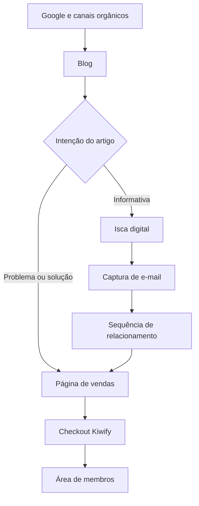
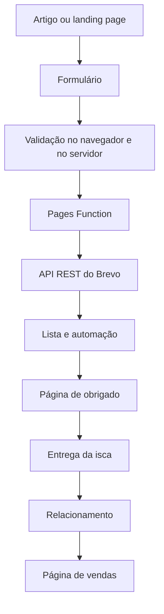

## Documentos Oficiais do Projeto

Este projeto é mantido com base em três documentos oficiais que devem ser utilizados em conjunto durante qualquer implementação.

1. Documentacao_Projeto_Escola_de_Pais_Online_v3_atualizada.md
   Arquitetura, infraestrutura, roadmap e decisões técnicas.

2. Checklist_Projeto_Blog_Escola_de_Pais_Online.md
   Checklist operacional e ordem prática de implementação do blog.

3. Manual_de_Design_e_Interface_Escola_de_Pais_Online.md
   Sistema de design, identidade visual, componentes e padrões de interface.

Toda implementação deve respeitar simultaneamente estes três documentos.


# Documentação Técnica — Escola de Pais Online
**Versão:** 3.1  
**Status:** Produção  
**Última atualização:** Julho/2026

---

# 1. Visão Geral

## Objetivo do projeto

A Escola de Pais Online é uma plataforma digital voltada para pais que desejam ajudar seus filhos na alfabetização matemática através do produto Explicador Matemático.

A arquitetura foi construída para ser simples, escalável e independente de plataformas proprietárias.

---

# 2. Arquitetura da Solução

```
Meta Ads
     │
     ▼
Página de Vendas
(escoladepaisonline.com.br)
     │
     ▼
Google Tag Manager
     │
 ┌───┴──────────────┐
 ▼                  ▼
GA4            Meta Pixel
                    │
                    ▼
             Evento InitiateCheckout
                    │
                    ▼
           Checkout Kiwify
                    │
      Purchase (Pixel + CAPI)
                    │
                    ▼
            Área de Membros
                    │
                    ▼
       Aplicativo HTML + Bônus
```

O blog adiciona um segundo fluxo de aquisição, voltado à construção de tráfego e relacionamento de longo prazo:


```mermaid
flowchart TD
    A[Google e canais orgânicos] --> B[Blog]
    B --> C{Intenção do artigo}
    C -->|Informativa| D[Isca digital]
    D --> E[Captura de e-mail]
    E --> F[Sequência de relacionamento]
    C -->|Problema ou solução| G[Página de vendas]
    F --> G
    G --> H[Checkout Kiwify]
    H --> I[Área de membros]
```

Os dois fluxos convivem no mesmo domínio, com a mesma identidade, mensuração e página de vendas.

---

# 3. Fluxo do Usuário

1. Visualiza anúncio.
2. Acessa página de vendas.
3. Consome a oferta.
4. Clica em Comprar.
5. Evento InitiateCheckout.
6. Checkout Kiwify.
7. Pagamento.
8. Evento Purchase.
9. Liberação automática da área de membros.
10. Uso do aplicativo.

---

# 4. Infraestrutura

## Domínio
- escoladepaisonline.com.br

## CDN
- Cloudflare

## Hospedagem
- Cloudflare Pages

## Repositório
- GitHub

## Deploy
GitHub → Cloudflare Pages (automático)

---

# 5. Estrutura do Projeto

```
/
├── index.html
├── blog/
│   ├── index.html
│   └── matematica/
│       ├── index.html
│       └── [slug-do-artigo]/
│           └── index.html
├── recursos/
│   ├── index.html
│   └── atividades-de-matematica/
│       └── index.html
├── obrigado/
│   └── atividades-de-matematica/
│       └── index.html
├── sobre/
│   └── index.html
├── contato/
│   └── index.html
├── politica-de-privacidade/
│   └── index.html
├── termos-de-uso/
│   └── index.html
├── functions/
│   └── api/
│       └── capturar-lead.js
├── assets/
│   ├── css/
│   │   ├── global.css
│   │   ├── blog.css
│   │   └── artigo.css
│   ├── js/
│   │   ├── main.js
│   │   ├── captura.js
│   │   └── analytics.js
│   ├── images/
│   │   ├── blog/
│   │   ├── artigos/
│   │   └── iscas/
│   └── icons/
├── downloads/
│   └── kit-gratuito-atividades-matematica.pdf
├── explicador-matematico/
├── robots.txt
├── sitemap.xml
├── favicon.ico
└── site.webmanifest
```

---

# 6. Stack Tecnológica

## Front-end
- HTML5
- CSS3
- JavaScript

## Infraestrutura
- Cloudflare
- Cloudflare Pages
- GitHub

## Analytics
- Google Analytics 4
- Google Tag Manager

## Marketing
- Meta Pixel
- Meta Conversions API (via Kiwify)
- Brevo
- Cloudflare Pages Functions para captura de leads

## Checkout
- Kiwify

## Área de membros
- MemberApp

---

# 7. SEO

## Implementado

- robots.txt
- sitemap.xml
- Open Graph
- favicon
- HTTPS
- Search Console

## Objetivo

Construção de autoridade orgânica de longo prazo.

## Padrão do blog

- um `<title>` e uma meta description por página;
- H1 único e estrutura correta de H2/H3;
- URL canônica;
- Open Graph por artigo;
- imagens otimizadas com dimensões declaradas;
- `BlogPosting` nos artigos;
- `BreadcrumbList` nos breadcrumbs;
- links internos entre artigo pilar, cluster, categoria e conversão;
- atualização do sitemap a cada publicação;
- páginas incompletas, testes e páginas de obrigado fora do índice.

---

# 8. Mensuração

## Google Analytics

Eventos:

- page_view
- session_start
- scroll
- click
- user_engagement

## Meta

- PageView
- InitiateCheckout
- Lead
- Purchase

## Eventos adicionais do blog

- view_blog_home
- view_article
- scroll_50
- scroll_90
- lead_form_start
- generate_lead
- lead_magnet_download
- cta_product_click

---

# 9. Gerenciadores

## Google
- Analytics
- Tag Manager
- Search Console

## Meta
- Business Manager
- Events Manager
- Pixel
- Domínio verificado

---

# 10. Checklist Operacional

## Antes de publicar

- Página revisada
- Links testados
- Checkout funcionando
- Pixel ativo
- Analytics ativo
- GTM publicado

## Após publicar

- Conferir eventos
- Conferir vendas
- Conferir área de membros
- Conferir carregamento mobile

---

# 11. Backup e Versionamento

Código-fonte

- GitHub

Deploy

- Cloudflare Pages

Versionamento oficial

O projeto utiliza três níveis de versionamento:

1. Commit Git
Registro de cada alteração significativa no desenvolvimento.

2. Release do GitHub
Representa uma versão estável do projeto.

3. Backup Local
Cópia completa da pasta do projeto armazenada fora do diretório de desenvolvimento.

Versão atual

Release:
v1.0-foundation

Status:
Primeira versão estável da infraestrutura.

Boas práticas

- realizar commit ao concluir uma funcionalidade;
- publicar uma Release apenas quando uma etapa importante estiver finalizada;
- criar backup local após cada Release importante;
- manter o CHANGELOG atualizado.

---

# 12. Changelog

## v3.1

- arquitetura completa do blog;
- categorias, páginas, URLs e templates;
- fluxo técnico de captura de e-mails;
- regras de consentimento, tags e automação;
- matriz de CTAs alinhada ao Explicador Matemático;
- clusters, ordem editorial e processo de publicação;
- eventos de mensuração e fases de implementação.

## v3.0

- documentação técnica completa;
- arquitetura documentada;
- stack documentada;
- fluxo do usuário;
- checklist operacional;
- plano SEO.

## v2.0

- organização da infraestrutura;
- analytics;
- pixel;
- checkout.

## v1.0

- documentação inicial.

---

# 13. Estrutura Completa do Blog

## 13.1 Objetivo e público

O blog tem quatro funções:

1. atrair pais e responsáveis por buscas orgânicas;
2. resolver dúvidas práticas sobre matemática de crianças de 6 a 9 anos;
3. capturar e-mails de visitantes que ainda não estão prontos para comprar;
4. conduzir visitantes com intenção maior ao Explicador Matemático.

Dor editorial central:

> “Eu sei a resposta, mas não sei como explicar para meu filho entender.”

Público secundário futuro: pedagogos, professores auxiliares e familiares que acompanham tarefas. A expansão só entra após validação do primeiro cluster.

## 13.2 Regra de conversão

Cada artigo possui um único objetivo principal:

- **captura de e-mail** em conteúdos informativos, exercícios e atividades;
- **página de vendas** em conteúdos sobre dor, explicação e solução;
- **checkout** somente depois de uma oferta clara e para visitantes com intenção alta.

| Tipo de conteúdo | CTA principal | CTA secundário |
|---|---|---|
| Informativo | Receber atividade por e-mail | Conhecer o produto no final |
| Atividade | Receber o kit gratuito | Ler conteúdo relacionado |
| Dor emocional | Ver como o Explicador funciona | Baixar atividade |
| Solução | Conhecer o Explicador | Receber kit gratuito |
| Comercial | Ir para a página de vendas | Checkout após apresentação da oferta |

O produto principal é o Explicador Matemático. A isca inicial será um único kit de atividades de soma, subtração, multiplicação e divisão, aproveitando o material já criado. Iscas específicas por operação serão produzidas apenas depois que os dados mostrarem necessidade.

## 13.3 Categorias

### Categoria inicial

**Matemática** — `/blog/matematica/`

Subtemas editoriais:

- alfabetização matemática;
- soma;
- subtração;
- multiplicação;
- divisão;
- atividades matemáticas;
- dificuldade em matemática;
- tarefa de casa.

O subtema recebe uma página própria somente quando possuir pelo menos três artigos úteis.

### Categorias futuras

- Leitura e escrita;
- Rotina escolar;
- Desenvolvimento e aprendizagem;
- Recursos para pais e pedagogos.

Uma nova categoria exige problema claro, produto ou isca relacionado, artigo pilar e pelo menos cinco artigos de apoio planejados. Categorias vazias não aparecem no menu.

## 13.4 Mapa de páginas

| Página | URL | Finalidade |
|---|---|---|
| Página inicial do blog | `/blog/` | Destacar categoria, artigos e isca |
| Categoria Matemática | `/blog/matematica/` | Organizar o cluster |
| Artigo | `/blog/matematica/[slug]/` | Atrair, ensinar e converter |
| Recursos gratuitos | `/recursos/` | Reunir iscas disponíveis |
| Landing page da isca | `/recursos/atividades-de-matematica/` | Capturar e-mail |
| Página de obrigado | `/obrigado/atividades-de-matematica/` | Confirmar, entregar e orientar |
| Sobre | `/sobre/` | Explicar missão e proposta |
| Contato | `/contato/` | Atendimento |
| Política de privacidade | `/politica-de-privacidade/` | Tratamento de dados |
| Termos de uso | `/termos-de-uso/` | Regras do site e materiais |

Padrão das URLs: letras minúsculas, hífens, sem acentos, datas ou termos desnecessários. URLs indexadas não devem ser alteradas sem redirecionamento.

## 13.5 Navegação

Cabeçalho:

- Logo;
- Início;
- Blog;
- Matemática;
- Recursos gratuitos;
- botão “Conhecer o Explicador Matemático”.

Rodapé:

- descrição curta da marca;
- Blog, Matemática, Recursos, Sobre e Contato;
- Política de Privacidade e Termos de Uso;
- link do produto;
- direitos autorais;
- aviso sobre limites do conteúdo educacional.

Breadcrumb de artigo:

`Início > Blog > Matemática > Título do artigo`

## 13.6 Templates

### Inicial do blog

- título e proposta;
- artigo principal;
- bloco Matemática;
- artigos recentes;
- captura da isca;
- apresentação curta do Explicador;
- rodapé.

### Categoria

- título e introdução;
- artigo pilar;
- grade de artigos;
- organização por subtema, se necessária;
- captura de e-mail;
- CTA do produto.

### Artigo

- breadcrumb;
- H1 e subtítulo;
- data de atualização;
- imagem principal;
- introdução que responde rapidamente à dúvida;
- componente editorial “Resumo rápido” com até cinco orientações principais;
- índice, quando necessário;
- H2/H3, exemplos e orientações práticas;
- CTA contextual no meio;
- bloco da isca ou do produto;
- perguntas frequentes;
- artigos relacionados;
- CTA final.

### Landing page da isca

- promessa específica;
- mockup;
- benefícios;
- formulário curto;
- informação de privacidade;
- CTA único;
- pouca navegação e sem distrações.

### Página de obrigado

- confirmação;
- instrução de acesso;
- botão de download, quando aplicável;
- orientação para conferir spam/promoções;
- CTA leve do Explicador;
- artigo recomendado.

## 13.7 Captura de e-mail

Fluxo:


```mermaid
flowchart TD
    A[Artigo ou landing page] --> B[Formulário]
    B --> C[Validação no navegador e no servidor]
    C --> D[Pages Function]
    D --> E[API REST do Brevo]
    E --> F[Lista e automação]
    F --> G[Página de obrigado]
    G --> H[Entrega da isca]
    H --> I[Relacionamento]
    I --> J[Página de vendas]
```

Campos:

- nome obrigatório;
- e-mail obrigatório;
- WhatsApp opcional.

Não coletar nome da criança, escola, notas ou dados infantis desnecessários.

Texto de consentimento:

> Ao enviar, você concorda em receber o material e conteúdos da Escola de Pais Online. Você pode cancelar a inscrição a qualquer momento. Consulte a Política de Privacidade.

### Arquitetura técnica

1. O formulário HTML envia para `/api/capturar-lead`.
2. Uma Cloudflare Pages Function valida os dados.
3. A Function normaliza e valida nome, e-mail e WhatsApp.
4. A Function envia o contato à API REST do Brevo.
5. Contatos novos são criados e contatos existentes são atualizados.
6. O contato é adicionado à lista configurada.
7. As chaves ficam em `BREVO_API_KEY` e `BREVO_LIST_ID`, nunca no código público.
8. A automação do Brevo envia o material por e-mail.
9. Após a confirmação, o visitante segue para a Página de Obrigado.

Decisão consolidada:

- utilizar formulário HTML próprio da Escola de Pais Online;
- não utilizar formulário incorporado do Brevo;
- utilizar Cloudflare Pages Functions e `fetch` nativo;
- manter analytics e eventos de conversão em Feature específica posterior.

### Lista e segmentação

Lista principal: **Leads — Escola de Pais Online**.

Tags/campos mínimos:

- `origem=blog`;
- `isca=atividades-matematica`;
- `tema=soma|subtracao|multiplicacao|divisao|geral`;
- `pagina_origem=[slug]`;
- `utm_campaign=[campanha]`;
- `estagio=lead`.

Usar lista principal e tags. Não criar uma lista separada para cada artigo.

## 13.8 Automação de e-mails

| Momento | Objetivo | CTA |
|---|---|---|
| Imediato | Entregar o kit | Acessar as atividades |
| Dia 1 | Ensinar a usar sem transformar em prova | Testar uma atividade |
| Dia 3 | Explicar por que saber a resposta não basta | Ler artigo relacionado |
| Dia 5 | Apresentar o mecanismo do produto | Conhecer o Explicador |
| Dia 7 | Fazer a oferta | Ir para a página de vendas |

Regras:

- todo e-mail contém descadastro;
- comprador não recebe sequência de venda inadequada, quando a integração permitir;
- não há promessa garantida de aprendizagem;
- todos os links são testados antes da ativação.

## 13.9 CTAs dentro dos artigos

Posições:

1. link discreto após a introdução;
2. CTA contextual depois do primeiro bloco prático;
3. bloco visual por volta da metade;
4. CTA principal após a conclusão;
5. artigos relacionados para continuar a navegação.

Exemplo de captura:

> Quer praticar com seu filho? Receba gratuitamente atividades de matemática para fazer em casa.

Botão: **Receber as atividades por e-mail**

Exemplo de produto:

> Se a dificuldade está em encontrar as palavras certas para explicar, o Explicador Matemático mostra o que dizer, o que mostrar e como praticar cada conta.

Botão: **Ver como o Explicador funciona**

## 13.10 Clusters de conteúdo

### Artigo pilar

**Como explicar matemática para uma criança entender**

### Soma

- Como ensinar soma para crianças de forma simples;
- Como explicar soma usando objetos de casa;
- Atividades de soma para crianças de 6 a 9 anos;
- O que fazer quando a criança conta nos dedos;
- Como explicar o “vai um”.

### Subtração

- Como ensinar subtração para crianças;
- Como explicar subtração usando objetos;
- Atividades de subtração para imprimir;
- Como explicar “emprestar”;
- Por que a criança confunde soma e subtração.

### Multiplicação

- Como ensinar multiplicação sem começar pela decoração;
- Como explicar multiplicação com grupos e objetos;
- Atividades de multiplicação;
- Como ajudar a criança que não entende a tabuada.

### Divisão

- Como ensinar divisão de forma simples;
- Como explicar divisão repartindo objetos;
- Atividades de divisão para iniciantes;
- O que fazer quando a criança não entende divisão.

### Pais e tarefa de casa

- Eu sei a resposta, mas não sei explicar matemática;
- Toda tarefa de matemática vira estresse;
- Como ajudar sem entregar a resposta pronta;
- O que dizer quando a criança trava;
- Como identificar em qual etapa ela se perdeu.

## 13.11 Ordem inicial de publicação

1. Como explicar matemática para uma criança entender;
2. Eu sei a resposta, mas não sei explicar matemática;
3. Como ensinar soma para crianças;
4. Como ensinar subtração para crianças;
5. Como ensinar multiplicação sem começar pela decoração;
6. Como ensinar divisão de forma simples;
7. Toda tarefa de matemática vira estresse;
8. Atividades de matemática para fazer em casa.

Depois, aprofundar o tema que gerar mais impressões, cliques, leads e interesse no produto.

## 13.12 Processo de publicação

Antes de escrever:

- definir intenção de busca, pergunta central e palavra-chave;
- escolher cluster, CTA principal, isca/produto e links internos.

Antes de publicar:

- revisar texto, H1/H2/H3 e metadados;
- testar links, botões, formulário e eventos;
- testar celular, tablet e computador;
- otimizar imagens;
- atualizar sitemap;
- realizar commit e confirmar deploy.

Depois de publicar:

- solicitar indexação quando necessário;
- criar links de conteúdos antigos para o novo;
- verificar indexação e eventos;
- revisar desempenho após 30, 60 e 90 dias.

## 13.13 Fases de implementação

### Fase 1 — Base

- diretórios e componentes;
- página inicial do blog;
- categoria Matemática;
- template de artigo;
- Sobre, Contato, Privacidade e Termos;
- menu, rodapé, robots e sitemap.

### Fase 2 — Captura

- isca inicial;
- plataforma de e-mail;
- landing page e página de obrigado;
- formulário, proteção anti-spam e tags;
- sequência de cinco e-mails;
- teste de cadastro, entrega e descadastro.

### Fase 3 — Conteúdo

- artigo pilar;
- artigos das quatro operações;
- dois artigos de dor;
- um artigo de atividades;
- links internos entre todos.

### Fase 4 — Otimização

- acompanhar Search Console e GA4;
- melhorar títulos e descriptions;
- testar CTAs;
- criar novas iscas somente com base nos dados;
- expandir os clusters vencedores.

## 13.14 Critérios de conclusão

- navegação responsiva;
- identidade consistente;
- CTA principal definido em todos os artigos;
- captura e entrega funcionando;
- consentimento, privacidade e descadastro implementados;
- eventos validados no GA4/GTM;
- links de vendas e checkout testados;
- sitemap atualizado;
- páginas de teste e obrigado fora do índice;
- fluxo testado em janela anônima e celular real.

## 13.15 Documento operacional

O arquivo `Checklist_Projeto_Blog_Escola_de_Pais_Online.md` contém o checklist detalhado para executar cada fase e deve ser usado como documento de trabalho do blog.

---

# Diretrizes Oficiais para Produção de Artigos

Esta seção passa a integrar permanentemente a documentação oficial da Escola de Pais Online e deve ser seguida em qualquer implementação futura de artigos. Estas diretrizes substituem orientações informais utilizadas anteriormente.

## Objetivo Editorial

Todos os artigos da Escola de Pais Online devem ser escritos para ajudar pais e responsáveis a compreender como explicar matemática às crianças de maneira simples, acolhedora e prática.

Cada artigo deve resolver uma intenção de busca específica e, ao mesmo tempo, fortalecer toda a arquitetura de conteúdo do blog.

O objetivo não é apenas responder uma pergunta isolada.

O objetivo é construir um cluster de conhecimento completo.

## Escrita orientada a Cluster de Conteúdo

Cada artigo deve fazer parte de um conjunto maior de conteúdos.

Antes de iniciar um novo artigo deve-se:

- analisar os artigos já existentes;
- identificar quais assuntos já foram aprofundados;
- identificar quais assuntos pertencem a outros artigos;
- evitar repetição de conteúdo;
- criar conexões naturais entre páginas.

Sempre que um assunto já possuir um artigo específico, fazer apenas uma breve introdução e direcionar o leitor para esse conteúdo.

Cada artigo deve acrescentar conhecimento novo ao cluster.

Nunca competir com artigos existentes.

## Jornada do Leitor

Todo artigo deve considerar que o visitante pode estar chegando diretamente pelo Google.

Durante a leitura o conteúdo deve conduzir naturalmente para o próximo passo.

Os links internos devem representar uma sequência lógica de aprendizagem.

Nunca inserir links apenas para SEO.

Todo link interno deve possuir justificativa editorial.

Ao terminar um artigo o leitor deve saber naturalmente qual conteúdo ler em seguida.

## Continuidade do Cluster

Antes de produzir qualquer artigo novo:

- revisar os conteúdos já publicados;
- identificar oportunidades de ligação;
- compreender a arquitetura do cluster.

Durante a escrita:

- aprofundar apenas o tema daquele artigo;
- preparar naturalmente futuras conexões;
- evitar sobreposição de conteúdos.

Todo novo artigo deve fortalecer o cluster inteiro.

## Coerência entre Artigos

Todos os artigos devem manter:

- mesmo tom de voz;
- mesma estrutura;
- mesma identidade editorial;
- mesmo padrão de escaneabilidade;
- mesmo nível de profundidade;
- mesma organização visual.

O leitor deve perceber que todos os artigos pertencem ao mesmo projeto.

## Priorização da Dor Emocional

Sempre que o assunto permitir, o artigo deve começar pela identificação emocional do leitor.

A ordem editorial recomendada é:

1. identificação;
2. acolhimento;
3. redução da culpa;
4. explicação do problema;
5. solução prática;
6. aprofundamento técnico;
7. apresentação natural do produto.

Nunca iniciar diretamente por conceitos técnicos quando existir uma dor emocional relacionada.

## Humanização

Sempre que possível utilizar pequenas cenas do cotidiano.

Exemplos:

- uma conversa durante a tarefa;
- guardar brinquedos;
- colocar a mesa;
- dividir frutas;
- organizar materiais escolares;
- pequenas falas entre pais e filhos.

Essas cenas devem aproximar o leitor da situação apresentada.

Evitar textos excessivamente expositivos.

O leitor deve conseguir imaginar a situação acontecendo.

## Linguagem

A linguagem oficial do projeto deve ser:

- acolhedora;
- simples;
- conversacional;
- respeitosa;
- objetiva;
- prática.

Evitar:

- excesso de linguagem pedagógica;
- tom professoral;
- julgamentos;
- linguagem que gere culpa.

## Estrutura Editorial

Sempre manter:

- abertura forte;
- identificação emocional quando aplicável;
- introdução objetiva;
- resumo rápido;
- índice;
- conteúdo dividido em seções curtas;
- exemplos reais;
- CTA contextual;
- FAQ;
- artigos relacionados;
- encerramento prático.

## Links Internos

Os links internos devem:

- parecer naturais;
- ampliar a compreensão do leitor;
- conectar conteúdos complementares;
- evitar repetição.

Jamais utilizar links apenas para aumentar quantidade de páginas visitadas.

## Intenção de Busca

Antes de escrever cada novo artigo responder internamente:

- Qual é a principal dúvida do visitante?
- O que ele provavelmente já sabe?
- O que precisa aprender neste artigo?
- Qual será o próximo artigo recomendado?

Essas respostas devem orientar toda a construção do conteúdo.

## Qualidade Editorial

Antes de considerar um artigo concluído verificar:

- resolve completamente a intenção de busca;
- acrescenta conhecimento novo ao cluster;
- possui boa escaneabilidade;
- possui exemplos reais;
- possui linguagem acolhedora;
- mantém coerência editorial;
- possui CTA natural;
- possui links internos relevantes;
- conduz o leitor para o próximo passo.

Somente após todas essas verificações o artigo deve ser considerado aprovado.

---

# 14. Estratégia de Crescimento

Curto prazo

- otimizar anúncios
- validar criativos

Médio prazo

- expansão do blog
- SEO
- crescimento orgânico

Longo prazo

- novos produtos
- novos aplicativos
- ecossistema Escola de Pais Online

---

# 15. Plano de Migração (se necessário)

Checklist:

- backup GitHub;
- exportar DNS Cloudflare;
- backup Analytics;
- backup GTM;
- backup Pixel;
- validar domínio;
- validar SSL;
- testar checkout;
- testar Purchase;
- testar área de membros;
- publicar nova versão.

---

# 16. Estado Atual do Projeto

## Status Geral

### Fase 0 — Estratégia
✅ Concluída

- Definição do posicionamento da marca;
- Público-alvo;
- Produto principal;
- Estratégia editorial;
- Estratégia de monetização;
- Arquitetura completa do blog.

---

### Fase 1 — Fundação
✅ Concluída

Infraestrutura técnica implementada e documentada.

Itens concluídos:

- Domínio configurado;
- Cloudflare Pages;
- GitHub;
- Deploy automático;
- Google Analytics 4;
- Google Tag Manager;
- Meta Pixel;
- Search Console;
- robots.txt;
- sitemap.xml;
- Página de vendas;
- Estrutura inicial de diretórios;
- Estrutura do Blog;
- Estrutura de páginas institucionais;
- Manual de Design e Interface (Fase 1 e Fase 2);
- assets/css/global.css (aprovado);
- templates/layouts/base.html (aprovado);
- Estrutura oficial de templates criada;
- Estrutura validada em desktop e mobile;
- Release oficial v1.0-foundation publicada no GitHub;
- Versionamento inicial do projeto estabelecido.

---

### Fase 2 — Componentes
✅ Concluída

Concluído:

- Feature 01 — Header Global
- Feature 02 — Footer Global

Resumo técnico do Footer:

- Componente reutilizável;
- HTML semântico;
- Integração ao template base;
- Grid responsivo;
- Mobile first;
- Links de navegação e institucionais;
- CTA do produto;
- Copyright e aviso educacional;
- Foco visível e navegação por teclado;
- Sem JavaScript específico;
- Validado em desktop, tablet e celular.

---

### Fase 3 — Blog
🟨 Em andamento — 90%

Concluído:

- Feature 03A — Estrutura da Página Inicial do Blog;
- Feature 03B — Conteúdo da Página Inicial do Blog;
- Feature 04A — Estrutura da Página da Categoria Matemática;
- Feature 04B — Conteúdo da Página da Categoria Matemática;
- Feature 05A — Estrutura do Template de Artigo;
- Feature 05B — Conteúdo do Primeiro Artigo Pilar;
- Feature 06 — Conteúdo Inicial do Cluster Matemática, composta pelas Features 06A a 06G;
- Feature 08 — Página de Recursos Gratuitos em `/recursos/`;
- Feature 09 — Landing Page do Kit Gratuito de Atividades de Matemática em `/recursos/atividades-de-matematica/`;
- PDF oficial do Kit Gratuito de Atividades de Matemática;
- Página de Obrigado em `/obrigado/atividades-de-matematica/`;
- formulário próprio de captura implementado na Landing Page;
- integração completa com Brevo pela API REST;
- Cloudflare Pages Function implementada em `/api/capturar-lead`;
- variáveis de ambiente `BREVO_API_KEY` e `BREVO_LIST_ID` configuradas;
- lista “Leads — Escola de Pais Online” integrada e funcionando;
- captura de nome, e-mail e WhatsApp funcionando;
- atualização de contatos existentes no Brevo funcionando;
- automação de entrega do Kit por e-mail funcionando;
- download direto do PDF funcionando;
- fluxo completo de captura validado em produção;
- estrutura HTML semântica da página `/blog/`;
- planejamento editorial da Home do Blog;
- Hero e CTA principal definitivos;
- artigo pilar em destaque e seis artigos iniciais definidos;
- títulos, resumos, categorias, slugs oficiais e textos alternativos das imagens;
- bloco da categoria Matemática e texto auxiliar da pesquisa;
- CTA definitivo do Explicador Matemático;
- substituição dos placeholders visíveis somente em `blog/index.html`;
- estilização base mobile first em `assets/css/blog.css`;
- integração do `blog.css` ao `blog/index.html`;
- estrutura HTML, CSS, Header, Footer e Design System preservados;
- validação da página em celular, tablet e desktop;
- Página da Categoria Matemática implementada em `/blog/matematica/`;
- Hero da categoria, breadcrumb, artigo pilar, grade de seis artigos, bloco da isca digital e CTA do produto implementados;
- estrutura e conteúdo da Página da Categoria Matemática revisados e aprovados;
- títulos, resumos, categorias, slugs e textos alternativos oficiais aplicados à categoria;
- responsividade, navegação por teclado, menu mobile, ausência de rolagem horizontal e console validados;
- Template oficial de artigos implementado em `blog/matematica/template-artigo.html`;
- primeiro artigo pilar “Como explicar matemática para uma criança entender” implementado;
- sete artigos complementares do Cluster Matemática implementados, cobrindo dificuldade para explicar, soma, subtração, multiplicação, divisão, estresse durante a tarefa e atividades para fazer em casa;
- links internos contextuais implementados entre o artigo pilar, os artigos emocionais e os conteúdos específicos das quatro operações;
- estrutura editorial definitiva com breadcrumb, cabeçalho editorial, imagem principal preparada, introdução, índice opcional, conteúdo semântico, CTA contextual, bloco da isca, FAQ, artigos relacionados e CTA final;
- componente “Resumo rápido” incorporado ao Template de Artigo e ao primeiro artigo pilar;
- Template de Artigo reutilizável e obrigatório para todas as próximas publicações do blog;
- Central de Recursos criada para reunir os materiais gratuitos disponíveis;
- Kit Gratuito de Atividades de Matemática apresentado como primeiro recurso da biblioteca;
- Landing Page do Kit Gratuito criada com Hero, benefícios, cards das quatro operações, orientações de uso e CTA do produto;
- formulário funcional integrado ao Brevo implementado na Landing Page;
- Header Global e Footer Global reutilizados sem alterações;
- Design System, responsividade, acessibilidade e padrões de SEO preservados.

Implementação das imagens do blog — ✅ Concluída:

- integração das imagens definitivas do blog concluída;
- oito capas oficiais dos artigos implementadas;
- oito imagens Open Graph oficiais implementadas;
- Home do Blog e Categoria Matemática atualizadas com as imagens definitivas;
- imagens dos cards e das páginas publicáveis atualizadas;
- atributos `alt`, `width`, `height`, `loading` e `decoding` configurados e validados;
- imagens Open Graph definitivas associadas aos oito artigos;
- capas organizadas em `assets/images/blog/capas/`;
- imagens sociais organizadas em `assets/images/blog/og/`;
- padrão de nomenclatura baseado no slug preservado em todas as imagens do lote.

Auditoria técnica da implementação das imagens — ✅ Concluída:

- caminhos físicos e referências locais validados;
- inexistência de referências quebradas confirmada nas páginas publicáveis;
- inexistência de placeholders visuais confirmada nas páginas publicáveis;
- placeholders mantidos somente no template reutilizável de artigos;
- favicons revisados e referências inexistentes substituídas pelo favicon SVG oficial;
- dimensões declaradas da logo corrigidas para corresponder ao arquivo físico;
- estratégias de `loading` e `decoding` revisadas para cabeçalhos, rodapés, capas e cards;
- uso de WebP validado para as capas e imagens Open Graph dos artigos;
- arquivos PNG mantidos somente onde atuam como fallback da logo, ícones de compatibilidade ou imagens sociais genéricas;
- thumbnails não utilizadas pelas páginas atuais e mantidas apenas como possível evolução futura do Design System, sem caráter bloqueante.

Feature 09A — Auditoria SEO e Padronização dos Metadados — ✅ Concluída:

**Data de conclusão:** 30 de julho de 2026

Objetivo:

- auditar todas as páginas públicas e padronizar o SEO técnico sem alterar layout, CSS, componentes, conteúdo editorial ou comportamento do site.

Escopo executado:

- revisão de títulos e meta descriptions;
- revisão e implementação de URLs canônicas absolutas;
- auditoria das diretivas `meta robots`;
- padronização de Open Graph e Twitter Cards;
- validação da hierarquia de headings;
- auditoria e correção dos links internos;
- revisão técnica das imagens, incluindo textos alternativos, dimensões intrínsecas e estratégia de carregamento;
- revisão das referências de favicon, Apple Touch Icon e `site.webmanifest`;
- levantamento de oportunidades de performance relacionadas a LCP, CLS, FCP e recursos bloqueantes.

Principais entregas:

- URLs canônicas implementadas nos oito artigos do Cluster Matemática;
- Open Graph completo e consistente nos oito artigos e na Categoria Matemática;
- Twitter Cards implementadas nos oito artigos e na Categoria Matemática;
- meta description provisória da Categoria Matemática substituída por descrição definitiva;
- links internos quebrados eliminados e cards relacionados atualizados com artigos já publicados;
- Home comercial corrigida para possuir exatamente um H1, sem alteração visual ou editorial;
- pixel técnico marcado como imagem decorativa;
- dimensões intrínsecas adicionadas às imagens da Home comercial;
- prioridade de carregamento configurada para a principal imagem da Home do Blog, da Categoria Matemática e dos oito artigos;
- Apple Touch Icon padronizado com `sizes="180x180"`.

Validações realizadas:

- auditoria final das 18 páginas públicas;
- títulos e meta descriptions únicos e adequados;
- canonicals absolutos e coerentes com as URLs definitivas;
- exatamente um H1 por página e ausência de quebras na hierarquia de headings;
- inexistência de links internos quebrados ou fragmentos inválidos;
- imagens referenciadas existentes, com atributos e prioridades de carregamento consistentes;
- favicons e ícones do manifesto existentes e corretamente referenciados;
- ausência de propriedades Open Graph e campos Twitter Card duplicados;
- correspondência entre metadados SEO, canonical, Open Graph e Twitter Cards;
- ausência de conflitos entre `loading="lazy"` e `fetchpriority="high"`;
- `git diff --check` concluído sem erros.

Decisão de indexação:

- as 16 páginas públicas aprovadas para indexação permanecem temporariamente com `noindex, nofollow`;
- a alteração dessas 16 páginas para `index, follow` será realizada somente na Publicação Oficial, após a conclusão e aprovação da homologação;
- a Página de Obrigado e o template interno permanecem permanentemente com `noindex, nofollow`;
- `robots.txt`, `sitemap.xml` e Google Search Console não foram alterados nesta etapa;
- nenhuma solicitação de indexação foi realizada.

Resultado:

- a auditoria foi concluída sem inconsistências técnicas remanescentes dentro do escopo da Feature 09A;
- a implementação e a documentação estão preparadas para integrar o mesmo commit da Feature 09A.

Situação atual da captura:

- Captura de Leads concluída;
- integração Cloudflare Pages Functions + Brevo validada;
- cadastro de novos leads e atualização de contatos existentes funcionando;
- e-mail e WhatsApp gravados corretamente no Brevo;
- lista “Leads — Escola de Pais Online” recebendo os contatos;
- automação de e-mail disparando após o cadastro;
- e-mail de entrega recebido e botão de acesso validado;
- Página de Obrigado e download do PDF funcionando;
- fluxo completo testado em produção e em janela anônima.

Com a conclusão desta etapa, a infraestrutura técnica principal do projeto e o funil de geração de leads estão operacionais.

Validações executadas:

- cadastro de novo lead;
- envio dos dados para o Brevo;
- gravação do contato;
- gravação do WhatsApp;
- disparo automático do e-mail;
- recebimento do e-mail;
- funcionamento do botão do e-mail;
- download do PDF;
- funcionamento da Página de Obrigado;
- testes em janela anônima;
- integração Cloudflare + Brevo.

Próximas implementações:

- homologação completa;
- publicação oficial do Blog;
- crescimento editorial e orgânico.

Próxima etapa oficial: **Homologação**.

---

### Fase 4 — Conteúdo
✅ Concluída

Concluído:

- Artigo Pilar “Como explicar matemática para uma criança entender”.
- Feature 06A — “Eu sei a resposta, mas não sei explicar matemática”;
- Feature 06B — “Como ensinar soma para crianças de forma simples”;
- Feature 06C — “Como ensinar subtração para crianças”;
- Feature 06D — “Como ensinar multiplicação para crianças sem decorar a tabuada”;
- Feature 06E — “Como ensinar divisão para crianças de forma simples”;
- Feature 06F — “Toda tarefa de matemática vira estresse: o que fazer”;
- Feature 06G — “Atividades de matemática para fazer em casa”.

Resumo técnico da Feature 06:

- sete novos artigos criados em diretórios próprios dentro de `blog/matematica/`;
- Template Oficial de Artigos reutilizado sem alteração de estrutura, CSS ou JavaScript;
- Header Global, Footer Global, componentes e padrões editoriais preservados;
- componente “Resumo rápido” aplicado com cinco orientações em todos os artigos;
- conteúdo original distribuído entre artigos emocionais, quatro operações e atividades cotidianas, sem sobreposição de intenção de busca;
- CTAs contextuais do Explicador Matemático, bloco da isca, FAQ e artigos relacionados implementados;
- links internos descritivos conectando o artigo pilar e os conteúdos complementares;
- favicon SVG padronizado nos arquivos do Template e dos artigos;
- `noindex, nofollow` mantido, sem canonical, Schema.org ou Open Graph definitivo nesta etapa.

Entregáveis:

- cluster inicial de Matemática com oito artigos concluído;
- quatro artigos específicos das operações concluídos;
- dois artigos de dor emocional concluídos;
- um artigo prático de atividades concluído;
- jornada interna de leitura entre os conteúdos implementada.

Validações executadas:

- HTML semântico, hierarquia de títulos e apenas um H1 por artigo;
- Resumo rápido, índice, CTA contextual, bloco da isca, FAQ, artigos relacionados, CTA final e Footer;
- links internos, botões, destinos dos artigos relacionados e arquivos de favicon;
- leitura em 390 px, 768 px e 1440 px;
- ausência de rolagem horizontal;
- console sem erros relacionados à implementação;
- ausência de textos provisórios, imagens definitivas, canonical, Schema.org e Open Graph;
- documentação, CSS, JavaScript e componentes globais preservados durante a criação dos artigos.

---

### Fase 5 — Otimização
🟨 Em andamento

Previsto:

- homologação do site;
- publicação oficial do Blog;
- acompanhamento do Search Console;
- testes de CTA;
- crescimento dos clusters;
- novas iscas digitais.

Atualização oficial de status:

- implementação e auditoria das imagens concluídas;
- Feature 09A — Auditoria SEO e Padronização dos Metadados concluída;
- próxima etapa oficial definida como Homologação.

---

# Roadmap Visual

Fase 0 — Estratégia

████████████████████ 100%

Fase 1 — Fundação

████████████████████ 100%

Fase 2 — Componentes

████████████████████ 100%

Fase 3 — Blog

██████████████████░░ 90%

Fase 4 — Conteúdo

████████████████████ 100%

Subetapa operacional — Captura de Leads

████████████████████ 100%

Fase 5 — Otimização

Status: em andamento — imagens e SEO técnico concluídos; homologação e Publicação Oficial pendentes.

Conclusão geral estimada do projeto: **84%**.

---

## Próximas Etapas Oficiais

### Etapa 1 — Finalização Visual

Implementar as imagens definitivas do projeto:

- imagens dos artigos;
- imagens Open Graph;
- imagens das páginas;
- revisão dos banners;
- revisão visual geral.

Atualização de status: implementação e auditoria das imagens do blog concluídas.

### Etapa 2 — SEO Final

Status: ✅ Feature 09A concluída em 30 de julho de 2026.

Concluído:

- revisão de Title;
- Meta Description;
- Canonical;
- Open Graph;
- Twitter Cards;
- hierarquia de headings;
- links internos;
- imagens e favicons;
- auditoria das diretivas `meta robots`;
- validação técnica final das páginas públicas.

Decisão registrada:

- 16 páginas públicas aprovadas para futura alteração para `index, follow`;
- `noindex, nofollow` mantido temporariamente nessas páginas até a Publicação Oficial;
- Página de Obrigado e template interno mantidos permanentemente bloqueados;
- `robots.txt`, `sitemap.xml` e Search Console preservados sem alterações nesta etapa.

### Etapa 3 — Homologação

Executar o checklist completo de publicação e validar:

- links;
- formulário;
- e-mail;
- download;
- responsividade;
- Analytics;
- GTM;
- Pixel;
- PageSpeed;
- favicon;
- sitemap;
- robots;
- páginas institucionais.

### Etapa 4 — Publicação Oficial

Após a aprovação da homologação:

- remover `noindex` das páginas públicas;
- solicitar indexação no Search Console;
- publicar oficialmente o Blog;
- iniciar o acompanhamento do SEO.

### Etapa 5 — Crescimento

Após a publicação:

- produzir novos artigos;
- criar novas iscas digitais;
- expandir clusters;
- acompanhar o Search Console;
- otimizar a conversão;
- iniciar o crescimento orgânico.
